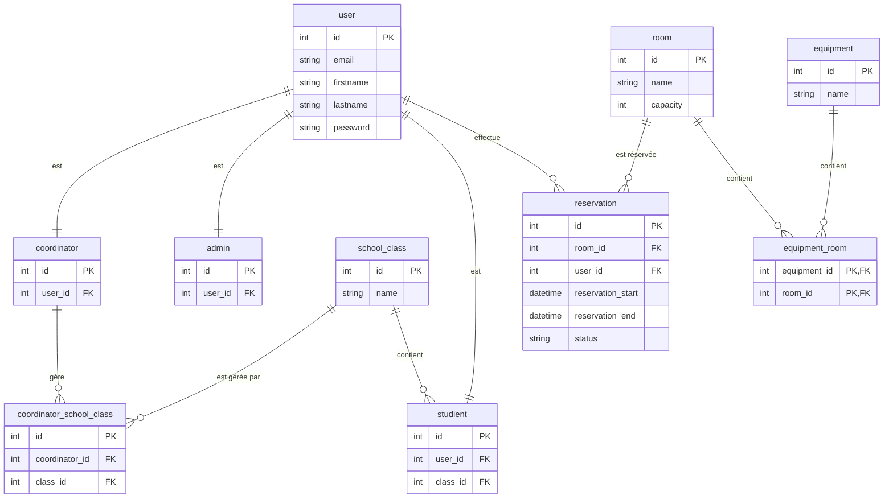
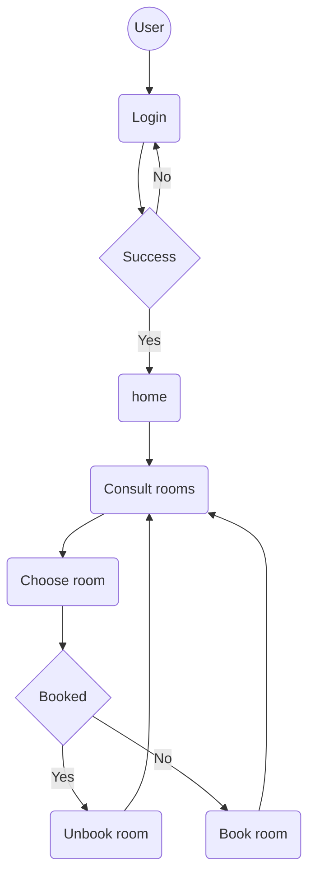
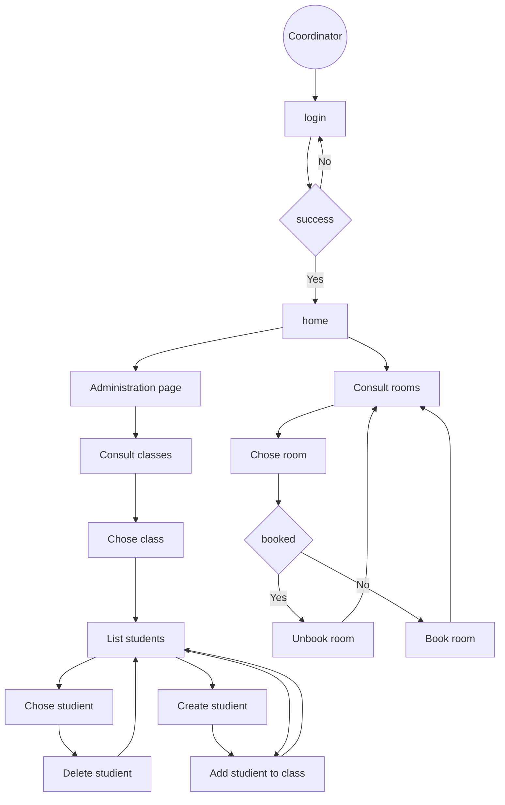
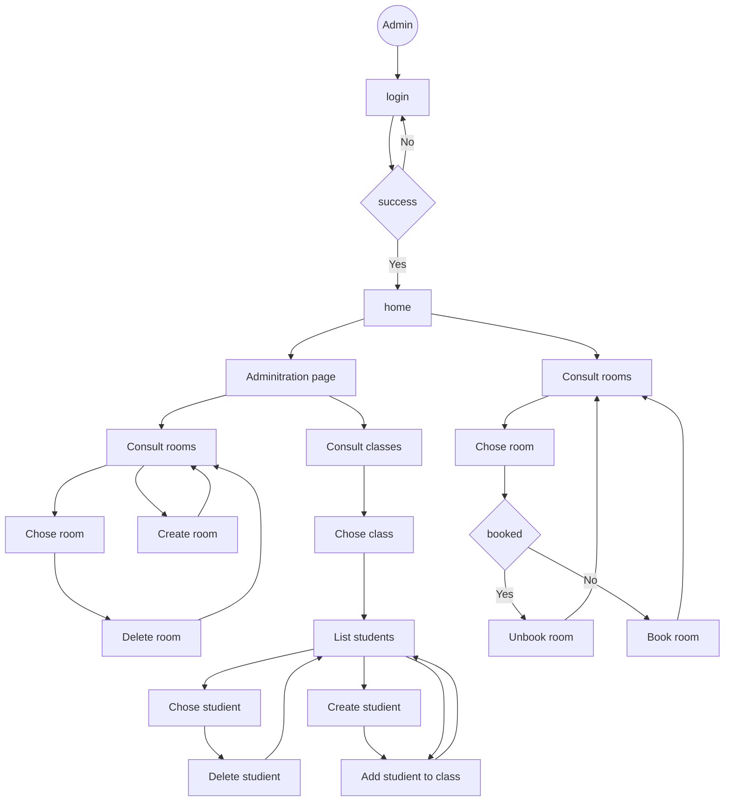

# realisation-professionnelle-bts-2-slam-iris
Projet de réalisation professionnelle pour les BTS 2 SLAM IRIS réalisé par mes soins

## Installation du projet

```bash
git clone https://github.com/Nicolas-Choquet-pour-MediaSchool-Nice/realisation-professionnelle-bts-2-slam-iris.git
cd realisation-professionnelle-bts-2-slam-iris
# remplire le fichier .env au moins avec l'url de connexion à la bdd
composer install
php bin/console doctrine:migration:migrate
php bin/console doctrine:fixtures:load
symfony server:start
```


## Déploiement production avec Docker Compose

1. L'envoie de l'image docker sur le registry GitHub est automatisé à chaque push sur `main`

2. Copier le fichier d'environnement dédié :
    ```bash
    cp .env.example .env.prod
    ```

3. Modifier les valeurs sensibles dans `.env.prod` (`DEFAULT_URI`, `DATABASE_URL`, `APP_SECRET`, etc.).

4. Lancer la stack en production :
    ```bash
    docker compose --env-file .env.prod -f docker-compose.prod.yml up -d --build
    ```

5. Vérifier les logs :
    ```bash
    docker compose --env-file .env.prod -f docker-compose.prod.yml logs -f
    ```

6. Arrêter la stack :
    ```bash
    docker compose --env-file .env.prod -f docker-compose.prod.yml down
    ```

## Diagrammes

### Diagramme de Relation (ERD)



### Diagramme d'activité Etudiant



### Diagramme d'activité Coordinateur



### Diagramme d'activité Administrateur
    

